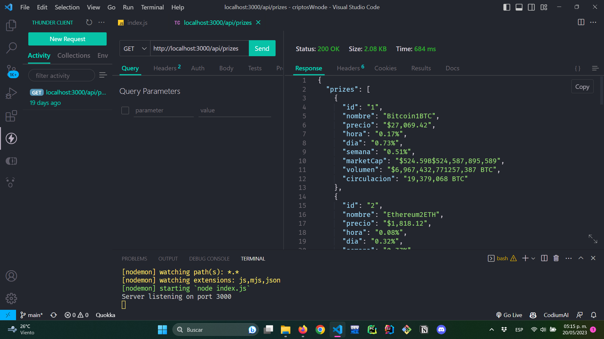

# criptosWithNodejs
This server app get current info about criptos and their properties, created with nodejs express and other models

1. User has to call the /api/prizes route
2. The server get coins info
3. The server respons with all info about criptos  

to use this server app first download the repository, execute the command npm install in main directory and execute npm run dev to test the program.

